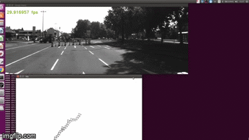

# Visual Odometry
Contains C++ Opencv implementation of Visual Odometry (IN PROGRESS)

Please note that this is a IN PROGRESS work.

Currently only the following is implemented:
- I used ORB to extract keypoints.
- Keypoint matching between consecutives frames.
- I used projective geometry constraints to refine matches (homography).
- Once matches are relatively OK I can use camera calibration parameters to find Essential matrix, camera pose and triangulate the keypoints to estimate their 3D position up to scale. During this process a final oulier rejection is performed to keep only few but sure points as landmarks.


TODO: 
- Local optimization with g2o or other optimization framework (and add inertial sensor inputs).
- Define a good data structure and representation for mapping (for embedded platforms)
- Global optimization
- Use all this for path planning


### These are preliminary results of odometry using Kitty dataset running on PC:





### 
### Dependencies and install:

- Cmake >= 2.6
- Boost 
- Opencv >= 4

As I compilled OpenCV from source and with specific options, I had to install several packages. Here there are the commands I used to install them:


- Packages to compile opencv and options I used:

```shell

sudo apt install -y  libjpeg-dev libpng-dev libtiff-dev

sudo apt install -y libavcodec-dev libavformat-dev

sudo apt install -y libgstreamer1.0-dev libgstreamer-plugins-base1.0-dev

sudo apt install -y libv4l-dev v4l-utils qv4l2 libdc1394-22-dev

sudo apt install -y libgtk2.0-dev libgtk-3-dev

sudo apt install -y libvtk6.3 libvtk6-dev

sudo apt install -y libeigen3-dev

sudo apt update && sudo apt install -y cmake g++ wget unzip
```

- Needed for viz:

```shell

sudo apt-get install libvtk6.3

sudo apt-get install libvtk6-dev

sudo apt-get install openssh-server

sudo apt-get install git
```

- Clone opencv and opencv_contrib

```shell

git clone https://github.com/opencv/opencv.git

git clone https://github.com/opencv/opencv_contrib.git

```

- Be sure both repositories are at the tag you want to use (here I used 4.4) 
 
 ```shell
 
cd opencv_contrib
git checkout tags/4.4.0 
cd ../opencv
git checkout tags/4.4.0
```


- Buiid opencv (go to opencv)
 
 ```shell
 
mkdir -p build && cd build

cmake   -D WITH_CUDA=ON \
        -D OPENCV_EXTRA_MODULES_PATH=../../opencv_contrib-4.1.1/modules \
        -D WITH_GSTREAMER=ON \
        -D WITH_LIBV4L=ON \
        -D BUILD_opencv_python2=ON \
        -D BUILD_opencv_python3=ON \
        -D BUILD_TESTS=OFF \
        -D BUILD_PERF_TESTS=OFF \
        -D BUILD_EXAMPLES=ON \
        -D CMAKE_BUILD_TYPE=RELEASE \
        -D ENABLE_PRECOMPILED_HEADERS=OFF \
		–D WITH_VTK=ON \
        -D CMAKE_INSTALL_PREFIX=/usr ..


make

```

- Install opencv:

 ```shell
sudo make install

```


### Commit legend:
feat: a change to implement a new feature

chore: a change does not impact functionnality like clean up the code

doc: a change to add documentation

fix: a change correct a bug, generally linked to an issue 


